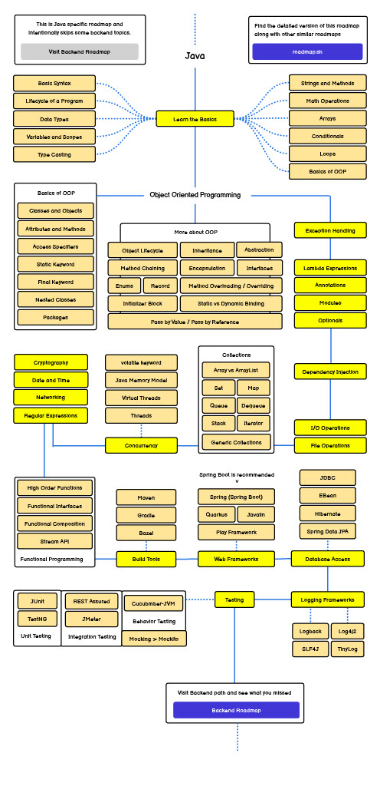

# ☕ Estudos de Java

Este repositório contém meus estudos em **Java**, seguindo o roadmap proposto pelo site [roadmap.sh/java](https://roadmap.sh/java). O objetivo é praticar e registrar tudo o que aprendo ao longo do caminho.

[📘 Meu Notion com anotações e exercícios](https://www.notion.so/22ae2669bbef800eaa7dd05c2cda5d98?v=22ae2669bbef8111a994000ca3cece1b)

---

## 🧭 Roadmap Java

Estou utilizando este roadmap como guia:

> 🔗 Fonte: [https://roadmap.sh/java](https://roadmap.sh/java)

---

